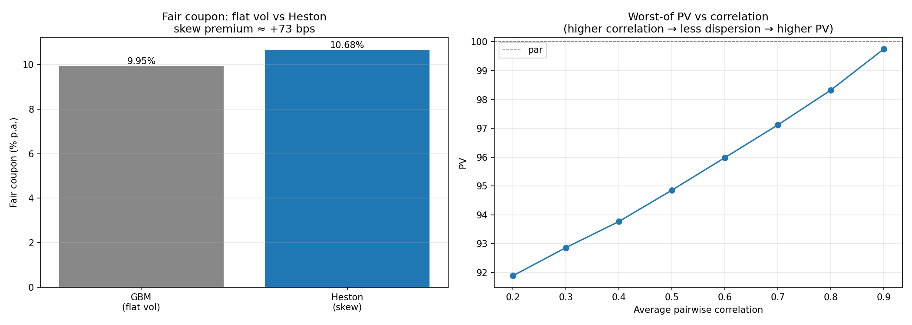

# Worst-of Phoenix Autocallable Pricer
[](https://github.com/ShrishDhuria/autocallable-pricer/actions/workflows/tests.yml)

A practitioner-grade Monte Carlo pricer for worst-of Phoenix autocallables on Euro Stoxx 50 / S&P 500 / Nikkei 225, with Heston stochastic-volatility calibration, live market data, and a Streamlit dashboard. Built around the products that French bank equity-derivatives desks (SG, BNP Paribas, Natixis) sell to retail in volume.

## What it demonstrates

Pricing a worst-of autocallable correctly requires three things that a desk does daily and a textbook rarely connects: multi-asset Monte Carlo with **correlated** drivers (the worst-of feature dominates the payoff), a **stochastic-volatility** model because the embedded knock-in put is short skew and a flat-vol price under-reserves it, and a **fair-coupon solver** because in practice the coupon is the output — the structurer quotes the coupon that prices the note at par. The headline result is the *skew premium*: pricing off a calibrated Heston surface rather than a flat vol moves the fair coupon by tens of basis points, which is what the desk earns and hedges over the life of the trade.



*Left: the fair coupon under flat-vol GBM vs a calibrated Heston surface — the gap is the skew premium. Right: worst-of PV as a function of average correlation, the dominant risk axis of the structure (higher correlation → less dispersion across underlyings → fewer knock-in breaches → higher PV). Regenerate with `python make_figures.py`.*

## How the product works

The note pays an above-market coupon in exchange for the investor taking equity
downside on the **worst-performing** of several underlyings (here SX5E, SPX,
NKY). At each annual observation, every underlying's performance is measured
against its strike (the level fixed at trade date), and the structure keys off
the *worst* of them:

> performance = spot / strike, and worst = min(performance) across all underlyings.

- **Autocall.** If the worst performer is at or above the autocall barrier
  (e.g. 100% of strike) on an observation date, the note redeems early at par
  plus any coupons due. Most notes end this way — early, and at par.
- **Coupon, with memory.** If the worst performer is at or above the coupon
  barrier (e.g. 70%), a coupon is paid; coupons missed below the barrier are
  remembered and paid in full on the next date the barrier is met.
- **Knock-in at maturity.** If the note never autocalled and the worst performer
  finishes below the knock-in barrier (e.g. 60%), the investor takes the equity
  loss of that worst performer. Otherwise par is returned.

Because the payoff always tracks the *minimum* across underlyings, the note is
**short correlation** (less correlation means more dispersion, a lower worst
performer, and more knock-in risk) and **short volatility** (it embeds a sold
down-and-in put). The coupon is the compensation for bearing those two risks —
and pricing it off a calibrated volatility surface rather than a flat vol is
what produces the skew premium shown above.

## Methodology references
- Heston, S. L. (1993). "A Closed-Form Solution for Options with Stochastic Volatility." *Review of Financial Studies*.
- Lewis, A. (2001). "A Simple Option Formula for General Jump-Diffusion and Other Exponential Lévy Processes." Working paper.
- Bouzoubaa, M. & Osseiran, A. (2010). *Exotic Options and Hybrids*. Wiley.

## Project structure
```
autocallable-pricer/
├── autocallable_pricer.py   # Phase 1 — single-asset reference pricer
├── market_data.py           # Phase 2 — live spot/vol/rate/div + correlation
├── worstof_pricer.py        # Phase 3-5 — worst-of MC, Greeks, fair coupon
├── heston.py                # Phase 4 — char-fn pricing, calibration, MC
├── calibrate_heston.py      # Phase 7 — multi-index calibration framework
├── app.py                   # Phase 6 — Streamlit dashboard
├── run_snapshot.py          # daily snapshot writer (CI)
├── make_figures.py          # regenerate the README figure (offline)
├── tests/                   # pytest suite (offline, identity/property tests)
├── sources.md               # data provenance
├── requirements.txt / requirements-dev.txt
└── .github/workflows/       # tests.yml + daily-snapshot.yml
```

## Status

| Phase | Scope | Module | Status |
|---|---|---|---|
| 1 | Single-asset Phoenix autocallable: memory coupon, autocall barrier, European KI | `autocallable_pricer.py` | Complete |
| 2 | Live market data — spot, realized vol, div yields, €STR, cross-asset correlation | `market_data.py` | Complete |
| 3 | Worst-of multi-asset MC with Cholesky-correlated GBM, antithetic variates | `worstof_pricer.py` | Complete |
| 4 | Heston stochastic vol — Lewis char-fn pricer, calibration, full-truncation Euler | `heston.py` | Complete |
| 5 | Fair-coupon solver (Brent) — quantifies the GBM-vs-Heston skew premium | `worstof_pricer.py` | Complete |
| 6 | Streamlit dashboard — GBM / calibrated-Heston / manual-Heston, fair-coupon, ladders | `app.py` | Complete |
| 7 | Multi-index calibration framework — SPX live, SX5E via Eurex, vol-scaled proxies | `calibrate_heston.py` | Complete |

## Quick start
```bash
pip install -r requirements.txt

# 1. Calibrate Heston per index (S&P 500 live; others by proxy)
python calibrate_heston.py --all                       # run during US market hours
python calibrate_heston.py --all --eurex oesx.csv      # real SX5E from a Eurex CSV

# 2. Price (auto-loads calibration/heston_params.json)
python worstof_pricer.py --heston                       # static demo inputs
python worstof_pricer.py --live --heston                # live SX5E/SPX/NKY

# 3. Dashboard
streamlit run app.py
```

## Calibration data

Heston is calibrated **per index**: S&P 500 live to the SPY option chain (the most liquid options market in the world, freely accessible, but requires US market hours); Euro Stoxx 50 from a Eurex OESX settlement CSV if supplied, otherwise inheriting S&P 500's skew shape with its variance level rescaled to SX5E's own realized vol. Full provenance is in [`sources.md`](sources.md).

## Limitations

Honest about what the model can and cannot do:

- **Inputs drive everything.** The PV is only as good as the calibrated surface, the correlation estimate, and the dividend assumptions. The SX5E/NKY proxies are explicitly second-best to a directly-calibrated surface.
- **One discount curve.** A single EUR rate discounts all legs; a production multi-currency book would discount per currency and add quanto adjustments for the non-EUR underlyings.
- **Flat correlation in scenarios.** The correlation ladder shifts all pairs uniformly; real correlation risk is richer (correlation tends to rise in stress).
- **Single daily-close vendor.** No intraday data and no bid-ask beyond the two-sided-quote filter used in calibration.

## Testing

The `tests/` directory holds a `pytest` suite asserting the mathematical
identities at the core of the pricer. It is driven by fixed-seed synthetic
inputs, so it runs offline with no market-data calls.

- **Black-Scholes / implied vol** — `implied_vol` inverts `bs_call` to machine precision.
- **Heston → Black-Scholes** — the characteristic-function call collapses onto Black-Scholes as the vol-of-vol `xi → 0`.
- **Monte Carlo convergence** — the Heston MC vanilla price matches the characteristic-function price within Monte Carlo error.
- **Worst-of structure** — PV rises monotonically with correlation and reproduces the single-asset PV in the perfectly-correlated, identical-asset limit.
- **Coupon & solver** — PV is monotone in the coupon; the fair-coupon solver round-trips to par.
- **Greeks** — delta is positive and vega negative on every leg under GBM (the note is short vol).

```bash
pip install -r requirements-dev.txt
pytest tests/ -q          # 10 tests
```

Tests run automatically on every push via GitHub Actions (`.github/workflows/tests.yml`).
